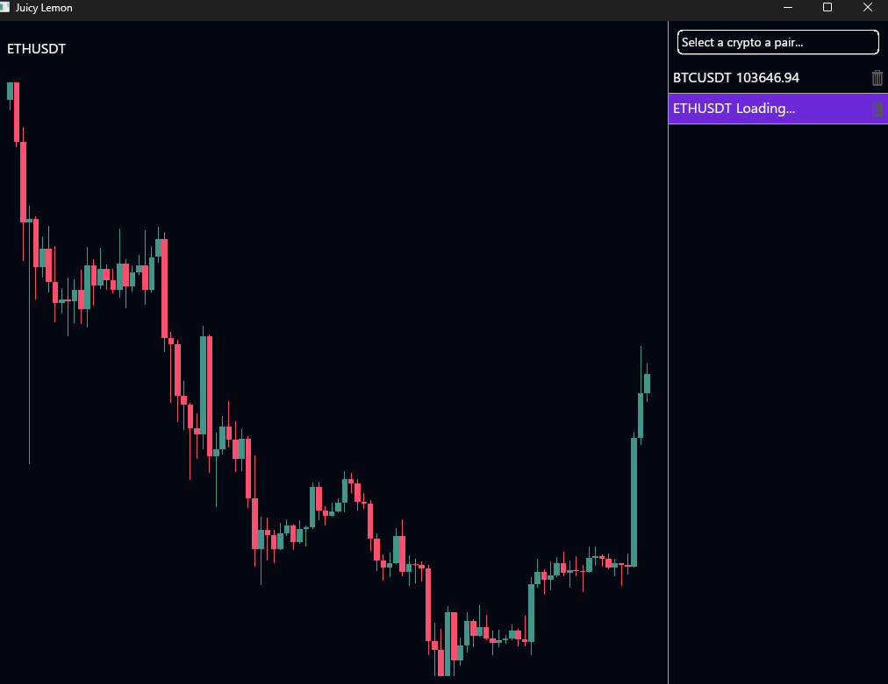

# Juicy Lemon

> A personal project to showcase my skills in Rust

Juicy Lemon is a crypto watchlist application featuring a responsive, native GUI built with `iced`. It integrates in real time with the Binance API and emphasizes clean architecture and high performance.

---

## Why I Built This

This project is part one of a series where I explore modern Rust UI libraries as alternatives to browser-based, React-dominated interfaces.

- Part one uses `iced`
- Part two will explore `egui`
- Part three will use `dioxus`

Through this project, I improved my skills in:

- Writing safe, concurrent Rust code
- Building reactive UIs with `iced`
- Working with WebSocket streams and REST APIs
- Creating real-world, user-facing applications in Rust

---

## Features

- Native, responsive UI built with [`iced`](https://github.com/iced-rs/iced)
- Real-time Binance price tracking
- Written entirely in Rust for performance and reliability

---

## Preview

---

## Tech Stack

- **Rust** – Core programming language
- **Iced** – Cross-platform GUI framework
- **Binance API** – Source for real-time market data  
